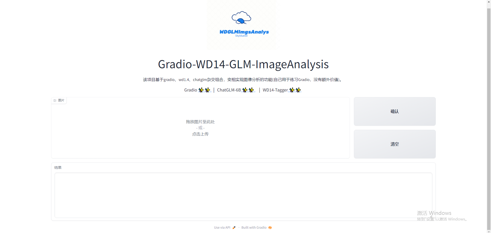
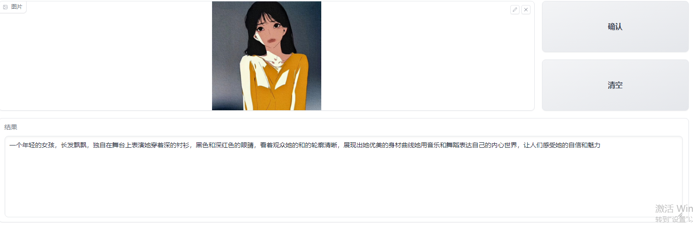
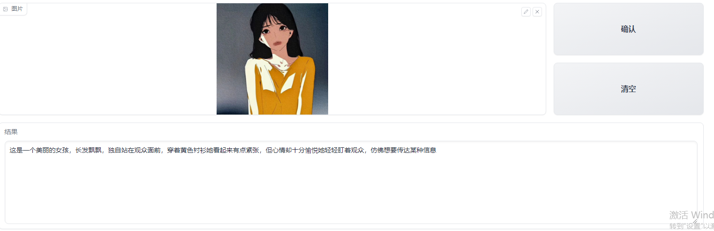

# <center>Gradio-WD14-GLM-ImageAnalysis</center>

该项目基于gradio、wd1.4、chatglm杂交组合，变相实现图像分析的功能，仅为自己练习Gradio，没有额外价值。

<center> Gradio <a href="https://www.gradio.app/"> ✨✨ </a> ｜  ChatGLM-6B <a href="https://github.com/THUDM/ChatGLM-6B"> ✨✨ </a>&nbsp ｜ WD14-Tagger <a href="https://github.com/toriato/stable-diffusion-webui-wd14-tagger"> ✨✨</a>&nbsp  </center>



## 快速开始

1.拉取代码

```
git clone https://github.com/Skyblueeeee/Gradio-WD14-GLM-ImageAnalysis.git
```

2.新建虚拟环境

```
conda create -n py39_imgA python==3.9
```

3.下载安装依赖

```
下载Torch、Torchvision：torch-2.0.0%2Bcu117-cp39   torchvision-0.15.0%2Bcu117-cp39
https://download.pytorch.org/whl/torch_stable.html

cd Gradio-WD14-GLM-ImageAnalysis

pip install 下载的torch

pip install 下载的torchvision

pip install -r requirements.txt -i 国内镜像源
```

4.下载模型

```
git clone https://huggingface.co/THUDM/chatglm-6b-4b.git

git clone https://huggingface.co/SmilingWolf/wd-v1-4-convnext-tagger-v2.git
```

5.测试效果





## 建议

1.如果真的有需求，可以选择更好的大语言模型。

2.使用开源的VisualGLM-6B模型等

https://github.com/THUDM/VisualGLM-6B
